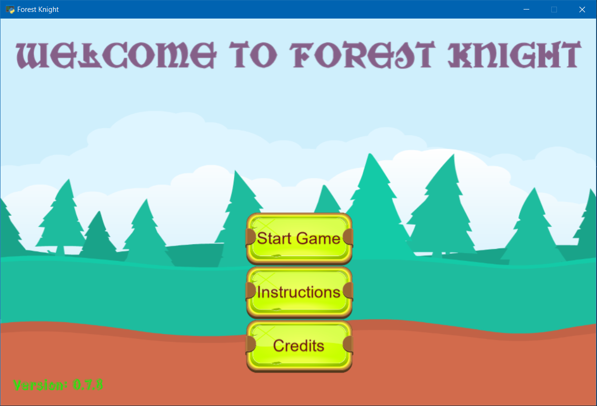

# Welcome to Forest Knight

A adventure Platformer game written in Python using the Arcade library

The game is still in its alpha stages and is being actively developed by me. For this game I am:

* Using the [Arcade Library](https://github.com/pythonarcade/arcade) to develop this game
* Using the [Tiled Map Editor](https://github.com/bjorn/tiled) to create all the different levels of this game

## Things left to complete

Check out `TODO.md`

## Assets used

Please check `CREDITS.md`

## Latest features from `TODO.md`

* Added decently-working Enemy auto-movement toward Knight and attack

## Features currently working on

* Mainly working on improving the GUI used throughout the game:
  * Using `arcade.gui` modules to build a better GUI in all the screens used in the game
  * Add a "Credits" screen
  * Add more functionality like save, exit, etc. in the Pause screen during gameplay
